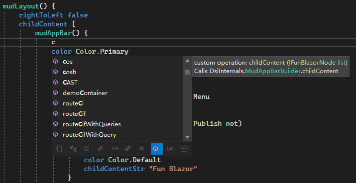

- id: b7153846-a280-4598-b8f9-cbc6dfe09a75
- title: Experiment on computation expression style for Blazor with F#
- keywords: feliz,fsharp,blazor,computation_expression
- description: Before I use Feliz style for the auto generated dsl but find its a little redundant, so let`s try CE style
---

Before I use Feliz style for the auto generated DSL but find it’s a little redundant, so let`s try CE style. The problem with Feliz style is obvious, every time you want to add attribute or some property you need to type the whole name for that component like below:


```fsharp
mudLayout.create [
    mudLayout.rightToLeft false
    mudLayout.childContent [
        mudAppBar.create [
            mudAppBar.color Color.Primary
            mudAppBar.elevation 25
            mudAppBar.dense true
            mudAppBar.childContent [
                mudIconButton.create [
                    mudIconButton.icon Icons.Material.Filled.Menu
                    mudIconButton.color Color.Inherit
                    mudIconButton.edge Edge.Start
                    mudIconButton.onClick (fun _ -> openMenu.Publish not)
                ]
            ...
```

For default DOM elements like div, span etc. they belong to a very short named type like html, attr. So you can write it very clearly like:


```fsharp
html.div [
    attr.styles [
        style.marginTop 20
        style.marginBottom 20
    ]
    html.text "hello world"
    ...
``` 

Anyway I wanted my other generated bingdings can be more clear and I started to experiment on CE style, it should look like this:

 
```fsharp
mudLayout() {
    rightToLeft false
    childContent [
        mudAppBar() {
            color Color.Primary
            elevation 25
            dense true
            childContent [
                mudIconButton() {
                    icon Icons.Material.Filled.Menu
                    color Color.Inherit
                    edge Edge.Start
                    onClick (fun _ -> openMenu.Publish not)
                }
             ...
```

I think it looks fatastic and very clear, but after I implemented it I found some drawbacks:

* The intelliense is not very good. In Visual Studio after you typing some char, it brings a lot of options to you and even you press alt+m, you still get some invalid options.

    

* fsharp can not always infer the types, sometimes you need to call CAST manually:

    ```fsharp
    html.watch (openMenu, fun isOpen ->
        mudDrawer() {
            open' isOpen
            elevation 25
            variant DrawerVariant.Persistent
            childContent [
                mudDrawerHeader() {
                    linkToIndex true
                    childContent [
                        mudText() {
                            color Color.Primary
                            typo Typo.h5
                            childContentStr "Have fun ✌"
                        }
                    ]
                }
                navmenu
            ]
            CAST
        }
    )
    ```

    html.watch has multiple overrides, one is aking for return a IFunBlazorNode, even mudDrawer implemented interface IFunBlazorNode, the compiler still give error only if you cast it maunally.

    childContent only asks for `IFunBlazorNode list`, F# can infer that so you do not need add cast.

* For CE (computation expression) style, F# do not support override CustomOperation(if the base class has same name for CustomOperation within the child class, fsharp compiler will raise error), so I have to flat inherited properties which may make the binding files a little bigger. And it does not feel good. And the conflicts made me also have to change some property name, like in default attr there is a min method, but if I inherited it then I have to change min to min' or something else to make the conflict go away.


Overall, I kind of like this CE style. But it is very opinionated, so in the Fun.Blazor.Cli I added support for both style for now.


For more information please check [Fun.Blazor](https://github.com/slaveOftime/Fun.Blazor) repo ✌