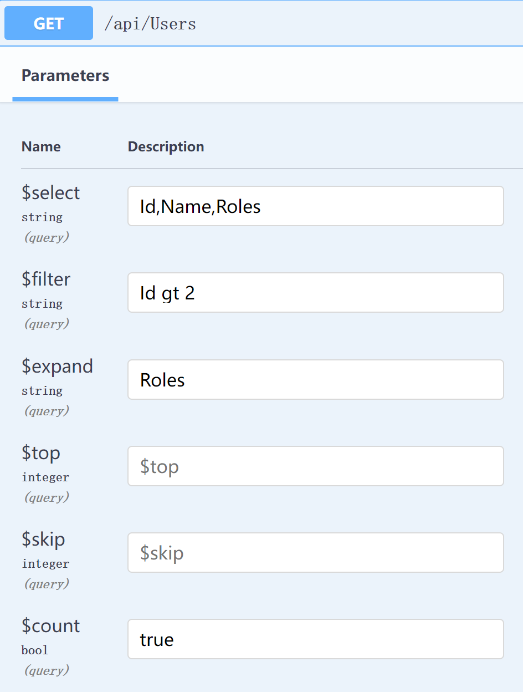

- id: 27898413-4e94-4915-b9b0-c6a9e081d1b3
- title: Use OData with fsharp and swagger in frontend and backend
- keywords: fsharp,odata,swagger
- description: Use the new Fun.OData.Query computation expression DSL to consume the apis which is setup with OData MVC and swagger
- createTime: 2022-05-29
---

[The source is on github](https://github.com/slaveOftime/Fun.OData/tree/master/demo)

Recently, I tried to update **Fun.OData.Query** with computation expression (CE) DSL, because I really love CE. It is so flexible and can be made with **InlineIfLamda** and get great performance. Also the CE can make the DSL so clean.

You may argue that the IDE intellisense is not very good for CE, but for me it is good enough as long as it make my code clean.
    
    Of course, if fsharp team can approve that then it will be perfect.  

## First let's set up the server

Let's first check the final result for the server setup.  
In the swagger you will see things like:



With above inputs you can get result:

```json
{
  "@odata.count": 1,
  "value": [
    {
      "Roles": [
        {
          "Id": 3,
          "Caption": "Guest",
          "Credential": "1234"
        }
      ],
      "Id": 3,
      "Name": "p3"
    }
  ]
}
```

The actual request url is like:

```txt
https://localhost:5001/api/Users?$select=Id,Name,Roles&$filter=Id gt 2&$expand=Roles&$count=true
```


Now I just use the default asp.net core MVC which can support OData very well to start the setup.

    Before I made a nuget package **Fun.OData.Giraffe** which can be used to integrate with [Giraffe](https://github.com/giraffe-fsharp/Giraffe), it works well with OData 7.x.x but after OData 8 it is not working any more. I also did not use giraffe for a long time, because my project really need better swagger support. So **Fun.OData.Giraffe** will be deprecated. Besides, there is no other people really use it.

Let's create a OData helper function:

```fsharp
type ODataResult =
    {
        [<JsonPropertyName "@odata.count">]
        Count: int64 option
        Value: IQueryable
    }

type ODataQueryOptions<'T> with
    member queryOptions.Query(source: IQueryable<'T>, ?setQuerySettings) =
        let querySettings =
            ODataQuerySettings(
                PageSize = 30,
                EnsureStableOrdering = false,
                EnableConstantParameterization = true,
                EnableCorrelatedSubqueryBuffering = true
            )

        (defaultArg setQuerySettings ignore) querySettings

        let count =
            if queryOptions.Count <> null then
                let filteredQuery =
                    if queryOptions.Filter = null then
                        source :> IQueryable
                    else
                        queryOptions.Filter.ApplyTo(source, querySettings)

                queryOptions.Count.GetEntityCount(filteredQuery) |> Option.ofNullable
            else
                None

        {
            Count = count
            Value = queryOptions.ApplyTo(source, querySettings)
        }
```

With above code, we can make our code cleaner in MVC controller like:

```fsharp
[<ApiController; Route "/api">]
type Endpoints(db: DemoDbContext) =
    inherit ControllerBase()

    /// Expose for OData query
    [<HttpGet "Roles">]
    member _.GetRoles(options: ODataQueryOptions<_>) = options.Query(db.Roles.AsNoTracking())

    /// Expose for OData query
    [<HttpGet "Users">]
    member _.GetUsers(options: ODataQueryOptions<_>) = options.Query(db.Users.AsNoTracking())

    /// Expose for OData query for single item
    [<HttpGet "Users/{id}"; EnableQuery>]
    member _.GetUsers(id: int) = db.Users.AsNoTracking().Where(fun x -> x.Id = id) |> SingleResult.Create
```

You will notice that, I did not use the OData default way, because for me I only need to enhance the **GET** request, so I can write less apis. I do not need mutation related stuff from OData too. And also with this way, all my apis are just pretty normal, you can even combine your own queries with OData's queries together. You just need to provide an IQueryable to it then it is done.

And another important thing is it can integrate very well with [entity framework core](https://github.com/dotnet/efcore). It means, it will help generate better **SQL**. Take the demo query at the beginning, the generated SQL is:

```sql
SELECT "t"."Id", "t0"."Id", "t0"."Caption", "t0"."Credential", "t0"."UserId", "t"."Name"
FROM (
    SELECT "u"."Id", "u"."Name"
    FROM "Users" AS "u"
    WHERE "u"."Id" > @__TypedProperty_0
    LIMIT @__TypedProperty_3
) AS "t"
LEFT JOIN (
    SELECT "r"."Id", "r"."Caption", "r"."Credential", "r"."UserId"
    FROM "Roles" AS "r"
) AS "t0" ON "t"."Id" = "t0"."UserId"
ORDER BY "t"."Id", "t0"."Id"
```

And if I change the request url to:
```txt
https://localhost:5001/api/Users?$select=Id,Name
```

And then, the SQL will become:

```sql
SELECT "u"."Id", "u"."Name"
FROM "Users" AS "u"
LIMIT @__TypedProperty_1
```


Then we will setup the swagger to make our api exploring experience better. What we need to do is:

1. Ignore the parameter which its type is ODataQueryOptions, because it will make swagger page very ugly. 

2. Then we will set some most used OData queries available for the swagger page, like **$count**, **$select** etc. Even we will not get autocomplete in swagger page, but at least it is usable from swagger page.

```fsharp
type OpenApiOperationIgnoreFilter() =

    let shouldIgnore (parameterDescription: ApiParameterDescription) =
        match parameterDescription.ModelMetadata with
        | :? DefaultModelMetadata as metadata ->
            let isODataQuery () =
                if metadata.UnderlyingOrModelType <> null && metadata.UnderlyingOrModelType.FullName <> null then
                    metadata.UnderlyingOrModelType.FullName.StartsWith("Microsoft.AspNetCore.OData.Query.ODataQueryOptions")
                else
                    false

            let hasIgnoreAttribute () =
                if metadata.Attributes.ParameterAttributes <> null then
                    metadata.Attributes.ParameterAttributes.Any(fun attribute -> attribute.GetType() = typeof<OpenApiParameterIgnoreAttribute>)
                else
                    false

            isODataQuery () || hasIgnoreAttribute ()

        | _ -> false


    let makeQuery name ty =
        OpenApiParameter(
            Name = name,
            AllowReserved = true,
            AllowEmptyValue = false,
            Required = false,
            In = ParameterLocation.Query,
            Schema = OpenApiSchema(Type = ty)
        )

    let addODataQuery (ps: System.Collections.Generic.IList<OpenApiParameter>) =
        ps.Add(makeQuery "$select" "string")
        ps.Add(makeQuery "$filter" "string")
        ps.Add(makeQuery "$expand" "string")


    interface IOperationFilter with

        member _.Apply(operation, context) =
            if operation <> null
               && context <> null
               && context.ApiDescription <> null
               && context.ApiDescription.ParameterDescriptions <> null then

                let mutable isODataOperation = false
                let mutable isODataQueryAdded = false

                context.ApiDescription.ParameterDescriptions
                |> Seq.filter shouldIgnore
                |> Seq.iter (fun parameterToHide ->
                    isODataOperation <- true

                    let parameter =
                        operation.Parameters.FirstOrDefault(fun parameter ->
                            String.Equals(parameter.Name, parameterToHide.Name, System.StringComparison.Ordinal)
                        )
                    if parameter <> null then
                        operation.Parameters.Remove(parameter) |> ignore
                        if not isODataQueryAdded then
                            operation.Parameters |> addODataQuery
                            operation.Parameters.Add(makeQuery "$top" "integer")
                            operation.Parameters.Add(makeQuery "$skip" "integer")
                            operation.Parameters.Add(makeQuery "$count" "bool")
                            isODataQueryAdded <- true
                )

                if not isODataQueryAdded
                   && context.MethodInfo.CustomAttributes.Any(fun x -> x.AttributeType = typeof<EnableQueryAttribute>) then
                    operation.Parameters |> addODataQuery
                    isODataOperation <- true


                if isODataOperation then
                    operation.Responses.Clear()
                    operation.Responses.Add("200", OpenApiResponse(Content = dict [ "application/json", OpenApiMediaType() ]))
                else
                    for resp in operation.Responses do
                        resp.Value.Content <- resp.Value.Content.Where(fun kv -> kv.Key.StartsWith "application/json;odata" |> not) |> Dictionary
```

Finally, you can setup the startup file for your asp.net core application:

```fsharp
services.AddControllersWithViews().AddOData(fun options -> options.EnableQueryFeatures() |> ignore)
...
services.AddSwaggerGen(fun options ->
    let securiyReq = OpenApiSecurityRequirement()
    securiyReq.Add(OpenApiSecurityScheme(Reference = OpenApiReference(Type = ReferenceType.SecurityScheme, Id = "Bearer")), [||])
    options.AddSecurityRequirement(securiyReq)
    options.OperationFilter<OpenApiOperationIgnoreFilter>() |> ignore
)
...
app.UseSwagger()
app.UseSwaggerUI()
...
app.MapControllers()
...
```

The helper functions for OData and swagger can be just copied and used in your project directly. It should be very simple, but it can really simplify things a lot, especially if you are developing internal enterprise application which need to consume a lot of different data from your frontend application.


## Frontend demo

**Fun.Data.Query** can be used to generate the OData queries with type safety and cleaner way. For example, you can write things like like:

```fsharp
type Role = { Caption: string }

type User = { Id: int; Name: string; Roles: Role list }

odata<User> () {
    count
    filter (
        odataAnd () {
            gt (fun x -> x.Id) 2
        }
    )
}
```

The generated url is similar as what the swagger will do:

```txt
$select=Id,Name,Roles&$filter=Id gt 2&$expand=Roles&$count=true
```

    We define the types in the frontend, it is used indicates what information we want according to our actual use case. For example, to get a brief list of paged items back, then drill down to detail information.

In the demo, I use [Fun.Blazor](https://github.com/slaveOftime/Fun.Blazor). For fetching the data, I extended the IComponentHook with below two methods:

```fsharp
// Only fetch Id,Name
member hook.LoadUsers(?top, ?page) =
    hook.ODataQuery<UserBrief>(
        "/api/Users",
        odata () {
            orderBy (fun x -> x.Name)
            skip (page |> Option.map (fun p -> p * 10))
            take top
        }
    )
    |> Task.map (
        function
        | Ok x -> DeferredState.Loaded x.Value
        | Error e -> DeferredState.LoadFailed e
    )

// Fetch detail information
member hook.LoadUserDetail(id: int) =
    hook.ODataSingle<User>($"/api/Users/{id}", odata () { empty }) |> Task.map DeferredState.ofResult
```

    **ODataQuery** and **ODataSingle** is just a simple helper method which is written in the demo project. They will inject HttpClient and compose the url path.


## Summary

I really like **OData**, but just use it in a very light way to enhance my **RESTful APIs** without make it complex. Also to consume it with **Fun.OData.Query** make it very nice and clean too. Anyway, with those things, I can build stuff very productively, at least for internal enterprise application.
