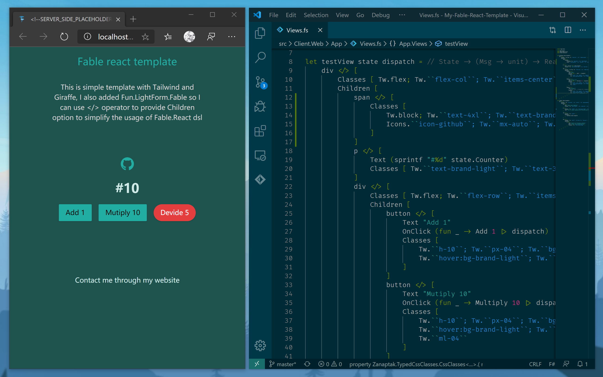

- id: aacf395b-7bd0-453f-b440-28dcc69ca54e
- title: React 的另类用法系列（俄罗斯方块）- 1
- keywords: react,fSharp,fable,MVU,俄罗斯方块,tetris
- description: React 这么流行，生态如此之广，资料也很多，在此我就分享一个比较另类的使用姿势。。。
- createTime: 2020-02-22
---

## 前言

我会在此开启一个关于React另类使用的系列。之所以做这样的分享，主要是刚开始入门的时候也是看其他前辈的视频分享，而今自己在行业里也混了好几年了，虽然才疏学浅，但是还是累积了一些经验，于是先小小的回馈一下社区。

## React

React我就不多介绍了，生态太好，应用太广，资料太多。但是F#和React的结合确实太另类，太小众，加上国内资料基本没有，所以想要分享一下。

我觉得小众并不代表不好，大众也并不一定就指庸俗，我喜欢这个另类的方式，是因为我自己在生产实践中感受到了它的好处：

1. React本身的生态它能够充分利用，如果加上binding（类似typescript的d.ts文件）体验会更好
2. F#作为.NET生态函数式编程的唯一，当然.NET的生态也能充分利用
3. 前后端都是F#，很多模型文件都可以共享
4. SSR（服务端渲染）可以自然而充分利用地.NET Core的高效
5. MVU+天然的immutable，可以很安全地搭配React地虚拟DOM渲染，并且让项目管理更方便，比redux更简洁
6. js能够做地F#都能做，因为F#最终都是通过fable和bable转换为js，并且F#和js的互操作还是很友好的
7. F#本身是非常优雅简洁，功能丰富的语言，工具链的支持虽然不及C#，但是还是非常不错了，至少我个人体验比js好
8. 暂时先说这么多废话

## 正事儿

我个人学习新东西还是喜欢看视频的方式，看文字比较晕，所以我也开始录制视频。刚开始技术不太好，虽然花了很多时间，但是还是效果不太理想，本来想录制声音，但是个人表达能力还有待提高，所以还是先用弹幕的方式了。

## 视频主要讲了一下内容：

1. F#, C#在.NET Core里的基本使用和区别
2. Clone 了项目 https://github.com/albertwoo/My-Fable-React-Template, 进行基本的React另类开发体验
3. 介绍了基本的工具和库的选择
4. 实现了一个”除数“的小功能