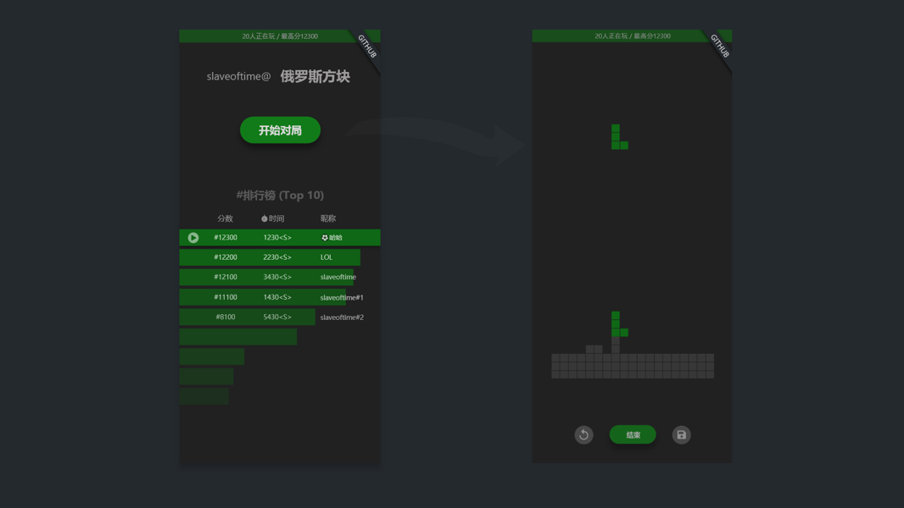

- id: 18151447-e18a-4827-b74a-18e491ea4bdb
- title: React 的另类用法系列（俄罗斯方块）- 2 (UI设计）
- keywords: react,fSharp,fable,MVU,俄罗斯方块,tetris
- description: 通过简单的UI设计，明确自己要实现的功能，理清自己的思路
- createTime: 2020-02-25
---

我本身并不是专业做UI设计的，也没有专门学过。但是既然要做一个系列，不免会需要明确自己的需求，构思简单的界面。所以我索性就把这个过程记录下来，分享出来。如果有专业设计师路过，还请重喷，这样我才能提高，感谢！！！

通过这个简单的设计，我明确了如果下一些开发要点：

1. 主页布局
2. 俄罗斯方块基本逻辑和规则
3. 游戏主界面 |> 保存记录
4. 前10排行榜
5. 精彩回放
6. 当前在线用户及最高分滚动显示

接下来的系列，我将根据上面的要点，结合自己的心情来具体开发了。

当然，我会从前端开始做起，毕竟系列的主题是React相关的。
