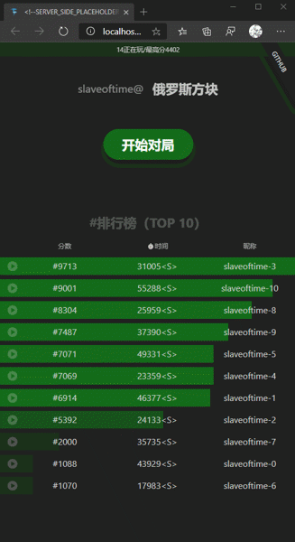

- id: 622df978-67b3-4cac-a3e5-c6961c547ccc
- title: React 的另类用法系列（俄罗斯方块）- 3 (项目搭建&主页逻辑构建）
- keywords: react,fSharp,fable,MVU,俄罗斯方块,tetris
- description: 这次的分享主要是项目搭建，以及根据先前的设计做主页的实现
- createTime: 2020-03-04
---

视频有点长，毕竟是live coding，加上技术有待提高，所以剪辑和加快之后还是挺长。

这次的分享主要是项目搭建，以及根据先前的设计做主页的实现，涉及到如下几个点：

1. 从https://github.com/albertwoo/My-Fable-React-Template拉去项目模板，初始化了工程
2. 清理代码
3. Domain的定义
4. States和事件的处理
5. 界面的实现
6. 如何找到和使用想要的图标https://icomoon.io/app
7. 使用React.Spring制作简单的动画。这里我用了我自己做的binding库(https://albertwoo.github.io/Fun.Animation/)
8. 重构代码

## 总结

当然这里之所以使用完整的Elmish的方式定义了App，看起来比较重。很多React新手教程里面直接就上函数式组件或者类组件，使用hooks或生命周期函数来处理业务逻辑，看起来比较简单。虽然这个主页逻辑还是挺简单，但是我还是偏向于业务逻辑重的组件使用比较分离的方式来做，UI和UI逻辑分离之后会比较清楚；而对于重用组件，我会偏向于纯函数组件的方式。

关于Elmish，其实就是MVU（Model-View-Update），更多资料可以参看：https://elmish.github.io/elmish/

* 源代码请见：https://github.com/albertwoo/Tetris