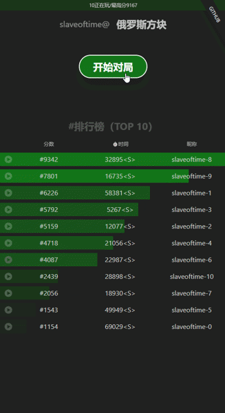

- id: c2384c75-4268-4cf5-811f-ec0f816a3dae
- title: React 的另类用法系列（俄罗斯方块）- 4 (Event sourcing）
- keywords: react,fSharp,fable,MVU,俄罗斯方块,tetris
- description: 实现俄罗斯方块的方式很多，但是用event-sourcing的方式做的还是很少，毕竟我没有见过，所以在此做一个简单的尝试
- createTime: 2020-03-17
---





* 源代码请参见： https://github.com/albertwoo/Tetris


我就不在此开启什么宏大的篇章来说event-sourcing了，一方面我也不是这方面的专家，再者这方面的资料还是蛮多的，再再者我也不知道event-sourcing对应的中文名词是什么🤣。

我之所以想用event-sourcing来实现俄罗斯方块的逻辑，一方面是学习和实践event-sourcing；另一方面主要还是觉得event-sourcing和俄罗斯方块游戏的规则很贴合。


```fsharp
type Operation =
    | RotateClockWise
    | MoveLeft
    | MoveRight
    | MoveDown
type Event =
    | NewBlock of Block
    | NewOperation of Operation
```


每一次操控(Operation)，相当于是一类事件，而另一类事件则是新的方块产生（NewBlock），这一系列的事件就是这个小游戏的本质。我们可以通过这一系列事件推算出不同的数据，比如消灭了多少行的方块，获得了多少分数，当前移动的方块的位置等等，都可以通多回溯这些事件来获得。

这就好比是财务做账一样，你永远只能添加一个新的记录，而不能修改旧的账目，否则就会出大事了。所以只要我们保存好了这些记录，我们就可以充分挖掘里面的价值。比如，添加一个回放的功能，就只需要简单地对保存的事件依次叠加就行了（用Projection.updatePlayground）。本质上就是一个做fold的函数。

    State -> Event -> State


我在Tetris.Core的项目里区分了Projection和Behavior：

Projection里都是根据当前状态，如果一个新的事件发生了，那我的状态应该怎么来更改我的状态。比如，事件是新的操控，且是向下落了一格，那我是否要计算有没有消灭新的行，游戏有没有结束，分数要不要增加等等状态。
Behavior就不一样，它主要包含的是在当前状态下，发生了一个新的事件，那会不会因此产生其他的事件。比如事件是新的操控，且是向下落了一格，如果此时正好会碰撞，那我则可以是生成一个新的方块，而这也就是一个新的事件。

另外有一点需要提出来的是，之所以我创建了一个新的项目Tetris.Core，主要是想到以后可能做一些本地端的实现，比如创建Client.WPF，Client.Android等项目，就完全可以重用Tetris.Core里的实现。

当然，这个实现在UI方面的性能上还有待提高，因为每次都会重新渲染方块。以后，一方面我可以用canvas来提高效率，另一种方法则是使用React的某些优化方法。留到以后再弄吧！！！


接下来的事情就更顺理成章了：
* 服务端代码实现
* 重构前端代码，以和服务端集成
