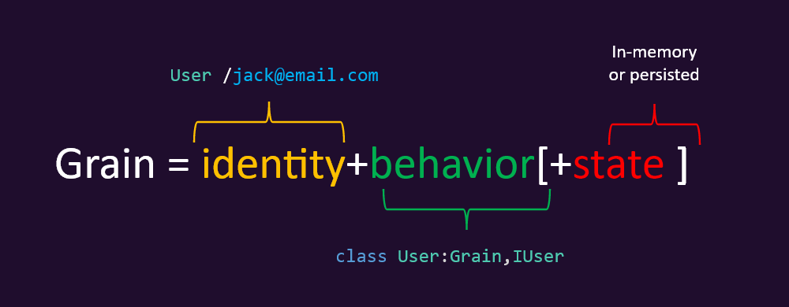

- id: 4e01d69c-0641-4d0c-a764-8e65ba109fb2
- title: React 的另类用法系列（俄罗斯方块）- 5 （全栈)
- keywords: react,fSharp,fable,MVU,俄罗斯方块,tetris,orleans
- description: 这次的分享主要是后端的实现，以及与前端的集成。另外，为了学习Orleans，我在后端的实现上用了它，虽然这样会增加复杂度，并且显得过度设计，但是出于学习的目的，还是很有趣的。
- createTime: 2020-05-03
---


> 源代码请参见：https://github.com/albertwoo/Tetris


这次的分享主要介绍了用F#实现后端的一些细节。总的来说用到了，Giraffe，Orleans，当然最基本的还是asp.net core。


## asp.net core

这个我就不多介绍了，我用它主要就是暴露几个接口，以及提供前端的打包文件。

```fsharp
services
    .AddCors()
    .AddGiraffe()
    .AddResponseCaching()
    .AddSingleton<Giraffe.Serialization.Json.IJsonSerializer>(Thoth.Json.Giraffe.ThothSerializer())
    .AddResponseCompression()
```

通过asp.net core默认的依赖注入的容器，我添加了Giraffe的支持，以及ThothSerializer，用来对FSharp的数据进行json序列化（Newtonsoft默认对FSharp的支持并不友好）；还添加了对响应数据的压缩等。

在asp.net core的管道配置部分我做了如下操作：

```fsharp
app
    .UseCors(fun builder -> builder.AllowAnyHeader().AllowAnyMethod().AllowAnyOrigin() |> ignore)
    .UseResponseCaching()
    .UseResponseCompression()
    .UseDefaultFiles() // comment this line for disable it for SSR support
    .UseStaticFiles(
        StaticFileOptions(
            OnPrepareResponse = fun ctx ->
                ctx.Context.Response.Headers.[HeaderNames.CacheControl] <- StringValues (sprintf "public,max-age=%d" (60*60*24*30))
        )
    )
    .UseGiraffe Routes.all
```

主要添加了静态文件的支持，也就是前端的打包文件。这样当用户访问https://tetris.slaveoftime.fun的时候就会路由到wwwroot下的index.html文件并把打包的js, css等文件通过浏览器加载，最终启动游戏。

另外还添加了Giraffe的路由配置，详见👇：


## Giraffe

我对Giraffe可以说是一见钟情，因为它让我觉得写后端的api原来可以这么简单和灵活。

作为一个用C#出身的人，对asp.net mvc那一套还是有一定认识的，当熟悉之后觉得controller, 以及各种各样的attribute也是很自然的，但是每当我要自己定制一点东西的时候我总得查很多资料才能做到，那时候它隐藏的复杂度就开始显现了。当然这毕竟是有微软的技术专家在实战中总结了很多经验才最终完善和确定下来的框架，而且近来asp.net core又添加了endpoint routing，使得asp.net core的灵活性提高了很多，而且复杂度也降了很多。

但是，如果是我个人的项目，我还是会选择Giraffe：

Giraffe是基于asp.net core的管道模型的，所以基本上asp.net core的生态，giraffe都能充分利用
Giraffe极大简化了对request, response处理的思想模型，让每一根管道都变成了简单的函数 HttpHandler（fun nxt ctx -> ...）

在俄罗斯方块这个游戏的后端实现中，我只用了一个文件Routes.fs来管理所有的接口，当然在大型的项目中通常还是会把每个handler的具体实现放在不同模块中。

下面，我将简单介绍一个接口：


```fsharp
GET     >=> routeCi "/robot/checker"
        >=> fun nxt ctx ->
            task {
                let factory = ctx.GetService<IGrainFactory>()
                let id = Guid.NewGuid()
                let robotChecker = factory.GetGrain<IRobotCheckerGrain>(id)
                let! base64 = robotChecker.GetCheckerImage()
                let! expireDate = robotChecker.GetExpireDate()
                let data = { Id = id; Base64ImageSource = base64; ExpireDate = expireDate }
                return! json data nxt ctx
            }
```


这段代码的意思就是，如果请求是GET类型，并且路径是/robot/checker(不区分大小写)，那么就获取一张用于检查爬虫机器访问的图片。>=> 这个是Giraffe定义的一个操作符，用来将不同的HttpHandler串在一起。


## Orleans

在我这个俄罗斯方块小游戏中使用Orleans，当然是有点过的，也可以说是完全大材小用。毕竟orleans是用来做高可用的跨平台分布式应用的。而我连服务器才一台，还是腾讯云的低配linux vm。而且我连高可用的数据库也没有，而是直接用的litedb。所以，除了用来练手学习之外，别无其它目的。

Orleans有两个比较重要的概念，一个是grain，一个是silo。grain我就瞎翻译成谷粒，silo我就瞎翻译成谷仓了。


👆 来自orleans官网

每一颗谷粒都是并发安全的，所以在我的IPlayerGrain中，它的TopRecord值始终会被安全地更新；并且，如果有大量地玩家也没有关系，我只要有足够的计算资源就可以实现弹性扩展，可以维护成百上千万的Player在内存中，这样我可以省下缓存并发，穿透等各种问题，而且让代码模型变得很简单。

当然很多技术听起来都是很美好的，使用起来却有各种坑，但是我还是很想尝试和学习这个技术的原因是：毕竟世界知名游戏Halo的后台就大量的使用了orleans的技术，而且包括霍尼韦尔等各大知名企业也在使用，另外这个模型应用在物联网上也很合适，而物联网是目前最热门的技术方向之一。


## 前端-Http调用

我使用了Fable.SimpleHttp这个库，另外我对它进行了简单的封装，都放在了Http.fs文件中。

举个栗子：

```fsharp
| UploadRecord (checker, record, AsyncOperation.Start) ->
    { state with UploadingState = Deferred.Loading }
    , Http.postJson "/api/player/record" record
      |> Http.headers [
          Header(RobotCheckerIdKey, checker.Id.ToString())
          Header(RobotCheckerValueKey, checker.Value.ToString())
      ]
      |> Http.handleAsync 
          (fun _ -> UploadRecord (checker, record, AsyncOperation.Finished()))
          (fun e -> UploadRecord (checker, record, AsyncOperation.Failed e))
      |> Cmd.OfAsync.result
```

当开始上传记录的时候，我会把UploadingState的状态该为Loading，这样界面上就可以根据这个状态来显示加载条。接着发一个Async的消息出去。这个消息就是一个Http请求，作为一个新的上传，我使用的是post，传入了相应的api路径和对象，接着添加了两个header参数，用来简单防止爬虫机器恶意访问。最后就是指定当请求返回后该发什么消息：如果成功了，就发Finished，否则就发Failed。


我在Common.fs中定义了两个简单的类型用来表达这种异步的需要比较长时间的操作和状态，便于我更准确的表达业务逻辑：

```fsharp
[<RequireQualifiedAccess>]
type Deferred<'T> =
    | NotStartYet
    | Loading
    | Loaded of 'T
    | LoadFailed of ClientError
    | Reloading of 'T
    | ReloadFailed of 'T * ClientError

[<RequireQualifiedAccess>]
type AsyncOperation<'T> =
    | Start
    | Finished of 'T
    | Failed of ClientError
```

很多基础的设施刚开始的时候看起来好像要做很多事情，但是当基础设施都做好之后，其他的高楼大厦建起了就非常快了，“基建狂魔”未尝不好。


## 总结

这次的分享主要是后端的实现以及和前端的集成，并且做了很多的重构，以及用户体验上的优化， CI/CD的配置等等。总的来说还是花了很多时间，但是也确实学习了不少，最主要的当然是orleans的初步了解，另外一些简单的细节上的东西比如，简单的防爬虫机器的做法，各种形式的交互（鼠标，键盘，手势）等等。


欢迎大家试玩和挑战最高分online👈，如果有什么建议可以提PR或者评论都可以。


这是本系列的最后一期了，作为一个不太会写博客的无名博主，我就当这些都是我的个人兴趣，以及对兴趣的简单记录。我也知道自己的文章用词拙劣，语句不通，所以也当是我提高语言表达能力的一种方式吧！！！以后还是不要写系列型的了，确实太难，太花时间了唉。。。。
