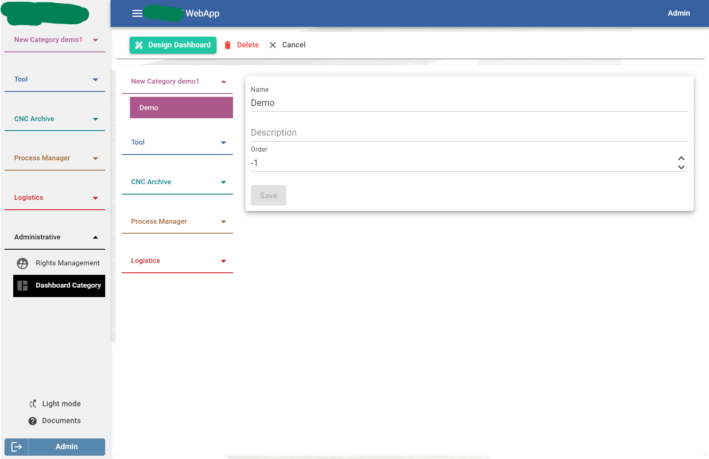
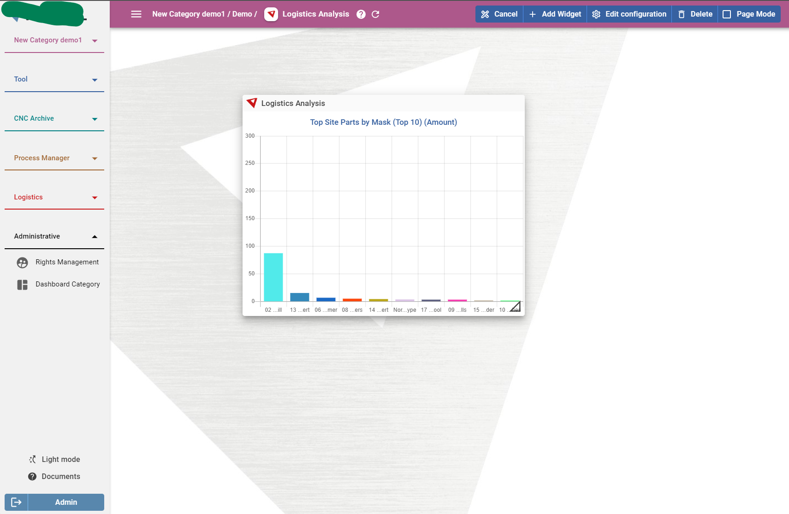
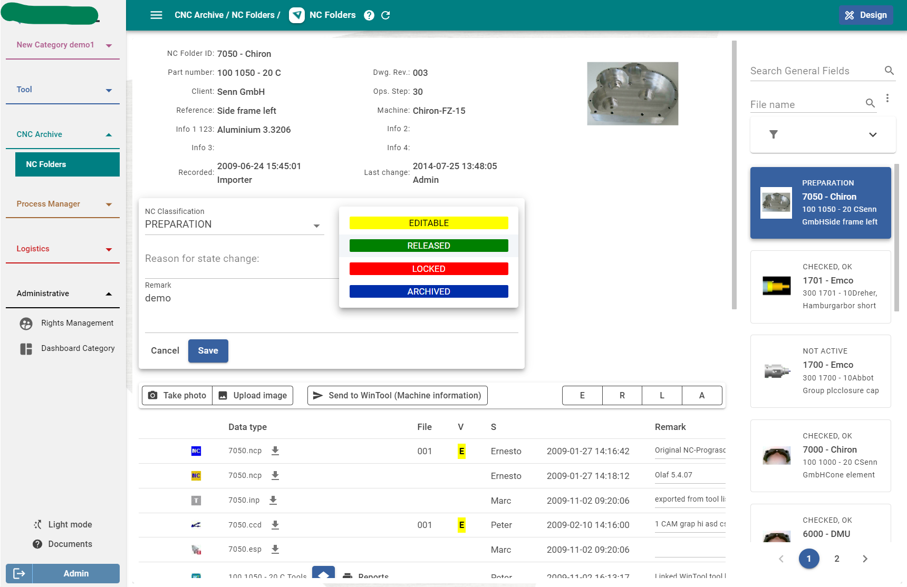
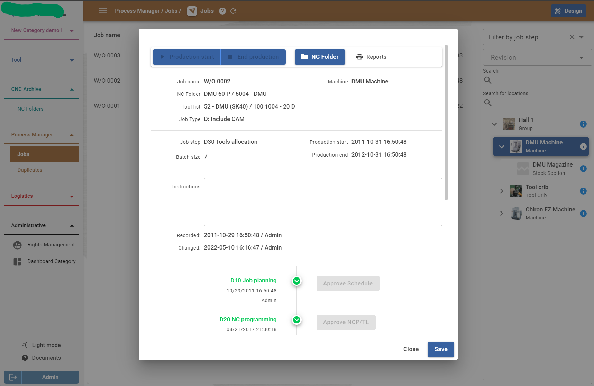
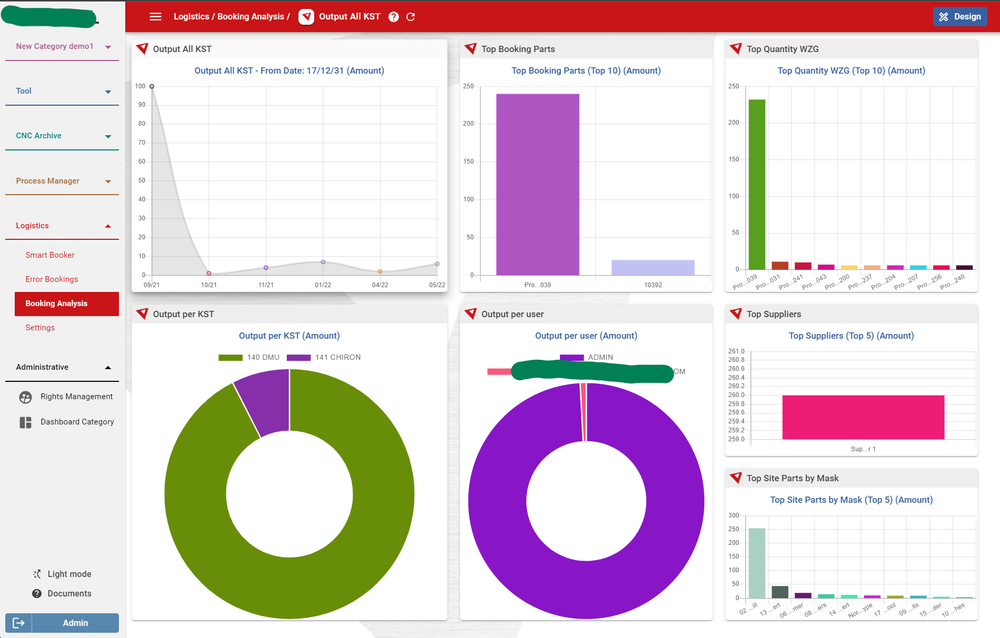
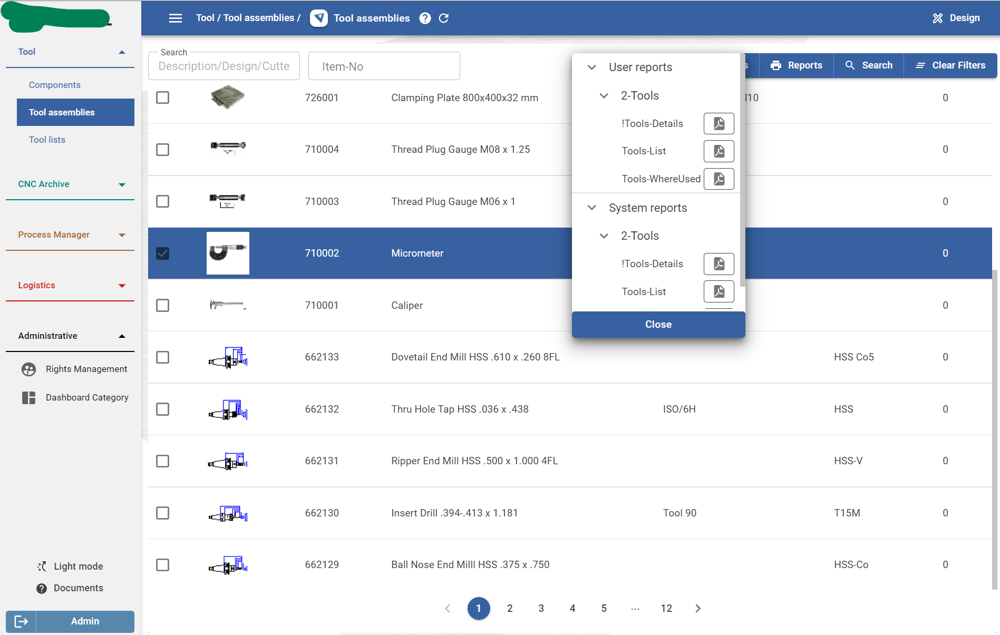
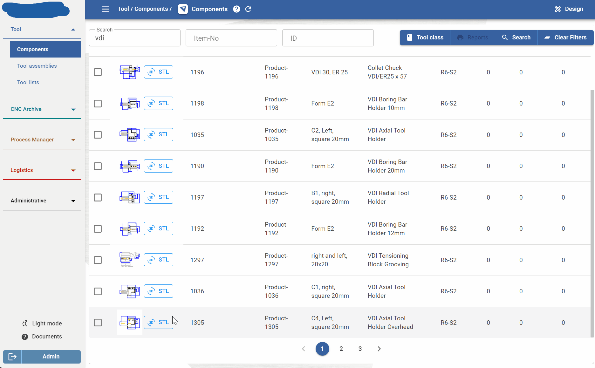
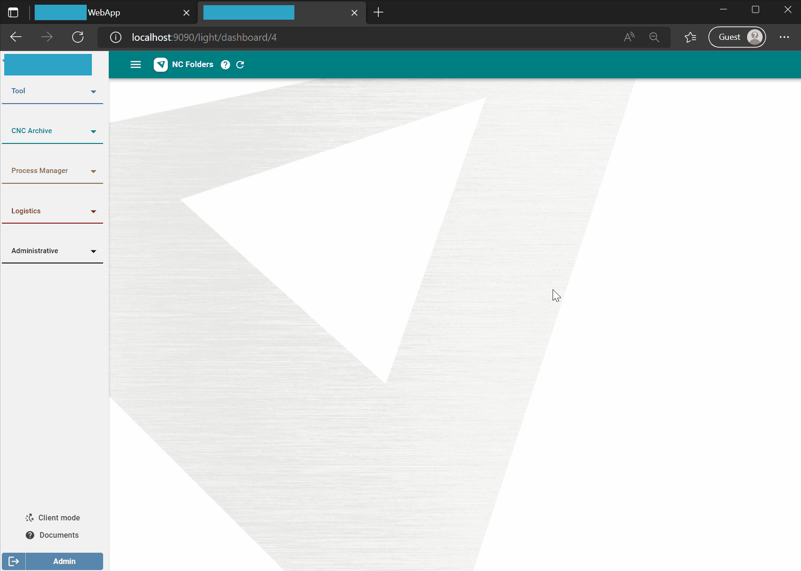

- id: 4846e40f-ee95-4f30-961b-db8484ae588c
- title: Real enterprise application with Fun.Blazor
- keywords: fsharp,blazor,aspnetcore
- description: Enough counter demo, let's have a look for a real enterprise application which is build with Fun.Blazor
- createTime: 2022-05-25
---

Fun.Blazor is in 2.0.0 recently, but actually is is under developing for couple of months, some of the features are came from this project.

## A glance on the application features

First, let's have a quick view for the application then we will check some code implementations.

- Manage widgets with dashboards, so customer can manage the left side menus accordingly and enable some widgets based on their license. They can drag, resize for multiple widgets in the same page or focus on some big widget in page mode to have a cleaner view.

    
    

- Rich features, like rich filter powered by OData, images, reports handling, process control etc. Of course, some data analysis visualization.

    
    
    
    

- Threejs interop with blazor

    

3. Mix server and wasm mode. For some mobile devices, server mode is kind of light mode and is very fast internally in an enterprise environment. 

    

    The gif is reduced the frames for small size, but the total time is not changed.  
    So it is very quick at least in local environment.


## Some code implementations

### Mix mode

Why it is important, because in the customers workshop there may be some low power devices, so running **WASM** mode of blazor is not that fast. But luckily, server side mode can improve that. For some other customers, they have factories located in different places on the earth, so the internet will not be that stable and fast, then WASM mode can help on that. For WASM mode, it is just like any other SPA application written by **react**, **vue** etc. which did not use websocket for almost all the communication between browser and server. 

How to implement that?

It is similar with the template in Fun.Blazor **dotnet new fb-mix -o CoolMix**

    dotnet new --install Fun.Blazor.Templates::2.0.0

1. Set a standalone wasm project which can publish for WASM mode
2. Set a **asp.net core** project which reference the WASM project.
3. Some glue code

    ```fsharp
    ...
    app.UseBlazorFrameworkFiles($"/{ClientRouteSegment}")
    ...
    app.MapBlazorHub($"/{ServerRouteSegment}/_blazor")
    app.MapFunBlazor($"/{DocsRouteSegment}/{{*path:nonfile}}", ClientPage.page (WASM true))
    app.MapFunBlazor($"/{ClientRouteSegment}/{{*path:nonfile}}", ClientPage.page (WASM false))
    app.MapFunBlazor($"/{ServerRouteSegment}/{{*path:nonfile}}", ClientPage.page SERVER)
    ```
4. The **ClientPage** will be the index file for server mode, wasm mode, or docs. 

    ```fsharp
    type ClientPage() =
        inherit FunBlazorComponent()

        override _.Render() =
    #if DEBUG
            html.hotReloadComp (xxxx.App.app, "xxxx.App.app")
    #else
            xxxx.App.app
    #endif

        static member page pageType ctx =

            let baseUrl =
                match pageType with
                | SERVER -> baseUrl $"/{ServerRouteSegment}/"
                | WASM _ -> baseUrl $"/{ClientRouteSegment}/"

            let root =
                match pageType with
                | SERVER -> rootComp<ClientPage> ctx RenderMode.ServerPrerendered
                | WASM isDocs ->
                    div {
                        id "app"
                        style { flexCenter }
                        childContent [
                            background
                            pureLoader
                            p { if isDocs then "Loading Docs" else "Loading WebApp" }
                            spaceV2
                            brand
                        ]
                    }

            let blazorJs =
                fragment {
                    match pageType with
                    | SERVER -> script { src "/_framework/blazor.server.js" }
                    | WASM _ -> script { src "_framework/blazor.webassembly.js" }
                    sharedJsInterop
    #if DEBUG
                    html.hotReloadJSInterop
    #endif
                }

            html' {
                style {
                    height "100%"
                    width "100%"
                    overflowHidden
                }
                head {
                    baseUrl
                    title { "WinTool WebApp" }
                    meta { charset "utf-8" }
                    meta {
                        name "viewport"
                        content "width=device-width, initial-scale=1.0, maximum-scale=1.0, user-scalable=no"
                    }
                    stylesheet $"/_content/WinTool.Client.Share/index.css?{RMP.cacheByAppVersion}"
                    stylesheet $"/_content/WinTool.Client.Share/fonts/fonts.css?{RMP.cacheByAppVersion}"
                    stylesheet $"/_content/MudBlazor/MudBlazor.min.css?{RMP.cacheByAppVersion}"
                }
                body {
                    root
                    script { src $"/_content/WinTool.Client.Share/chart.js?{RMP.cacheByAppVersion}" }
                    script { src $"/_content/MudBlazor/MudBlazor.min.js?{RMP.cacheByAppVersion}" }
                    blazorJs
                }
            }
    ```

5. Another important thing is handling the http requests. To keep things simple and less bug, even for server side mode, the application will use HttpClient to send request instead of inject server side services. And a lot of the apis are powered by OData, so with HttpClient there will have no code changes for both mode. One important thing need to do is passing the cookie for the server side mode, because all the requests is on the server which is like a **BBF** layer, so the cookie will not automatically append like in the browser.

    ```fsharp
    type IServiceCollection with
        member services.SetupXXX() =
            ...
            services.AddScoped<IHttpClientHelper>(fun sp ->
                let httpContext = sp.GetService<IHttpContextAccessor>()
                let notify = sp.GetService<Notification>()
                let nav = sp.GetService<NavigationManager>()
                let cookie = httpContext.HttpContext.Request.Headers.Cookie.ToString()
                let baseUrl = httpContext.HttpContext.Request.Scheme + "://" + httpContext.HttpContext.Request.Host.ToString()

                { new IHttpClientHelper with
                    member _.GetCookie() = cookie
                    member _.GetBaseUrl() = baseUrl
                    member _.InspectResponseError(error) =
                        match error with
                        | HttpError.ApiShouldRedirectBecauseNoAuth _ -> nav.NavigateTo($"/{ServerRouteSegment}", forceLoad = true)
                        | _ -> error.Handle notify
                }
            )
    ```

6. After finished the main part, other stuff is pretty straightforward. Just inject some services and setup **asp.net core** and use it in normal way, some boring MVC stuff 😂.


### Dependency injection for UI component

You will notice that in the application, there are multiple domains which are developed and isolated separately, but from the UI point of view, they need to integrate with each other to make customers happier. Actually there is nothing special here in Fun.Blazor, because you just implement it like below which is normal interfaces/services from asp.net core DI container's point of view.

1. Define the interface of the domain specific UI component, like:

    ```fsharp
    type IXXXCoreComponent =
        abstract member ReportPrinter: category: Reports.ReportsCategory * ids: aval<int64 list> -> NodeRenderFragment
    ```

    Basically, they just need to return **NodeRenderFragment**, so it can be used every easily. But it is not necessary, for example, if you just want to show a dialog, you can just return **unit**.

2. Implement this component in its own domain and register at the program starting setup file.

    ```fsharp
    services.AddScoped<IXXXCoreComponent, XXXCoreComponent>()
    ```

3. Lastly, consume it

    ```fsharp
    let toolbar =
        html.inject (fun (hook: IComponentHook, store: IShareStore, coreComp: IXXXCoreComponent) ->
            ...
            adaptiview () {
                let! i18n = store.I18n
                ...
                div {
                    style { displayFlex; flexWrapWrap; alignItemsCenter }
                    childContent [
                        ...
                        MudSpacer'.create ()
                        MudButtonGroup'() {
                            Variant Variant.Filled
                            Color Color.Primary
                            childContent [
                                ...
                                coreComp.ReportPrinter(
                                    Reports.ReportsCategory.Part, 
                                    hook.SelectedPartIds |> AVal.map (List.map int64)
                                )
                                ...
                            ]
                        }
                    ]
                }
            }
        )
    ```


### State management

State management is not easy, but with [FSharp adaptive model](https://slaveoftime.github.io/Fun.Blazor.Docs/?doc=/Adaptive/About), building dependency graph of state will be easier. First, let's see some basic share states:

```fsharp
type IShareStore with
    member store.Lang = store.CreateCVal(nameof store.Lang, "en-US")

    member store.IsWindowsAuth = store.CreateCVal(nameof store.IsWindowsAuth, false)
    member store.CurrentUser = store.CreateCVal(nameof store.CurrentUser, LoadingState<AccountResp>.Loading)
    member store.CurrentUserAfterLogin = store.CurrentUser |> AVal.map (fun x -> x.Value.Value) |> AVal.force

    member store.Roles = store.CreateCVal(nameof store.Roles, List.empty<Role>)
    member store.Permissions = store.CreateCVal(nameof store.Permissions, List.empty<Permission>)
    member store.AmIAdmin() = ...

    // build a dependency with other states
    member store.MyPermissionFor(target, right) =
        adaptive {
            let! permissions = store.Permissions
            let me = store.CurrentUserAfterLogin
            let isInRole id = me.Roles |> Seq.exists (fun x -> x.UserRoleId = id)
            let isGranted = permissions |> List.exists (fun p -> p.Target = target && isInRole p.RoleId && p.HasRight right)
            return isGranted || store.AmIAdmin()
        }

    member store.MyPermissionForPermission(right) = store.MyPermissionFor(ModifyPermission, right)
    member store.MyPermissionForDashboard(id, right) = store.MyPermissionFor(Dashboard id, right)
```

There are also some domain states which are shared like below. With this it can sync state across different domain components very easily and also consuming them is very simple with **adaptiview** or just consuming it in another adaptive expression to build up the dependency graph.

```fsharp
type IComponentHook with
    /// Helper function for domain states which can be cached and shared across the whole application
    member hook.GetOrLoadSharedStore<'T, 'Services>(key: string, reload, getter: 'Services -> Task<LoadingState<'T>>) =
        let store = hook.ShareStore
        let data = store.CreateCVal(key, LoadingState<'T>.NotStartYet)
        let isFirstLoad = store.CreateCVal(key + "-first-load", true)

        if reload || isFirstLoad.Value then
            transact (fun () ->
                isFirstLoad.Value <- false
                data.Value <- LoadingState.start data.Value
            )
            getter (hook.ServiceProvider.GetMultipleServices<'Services>()) |> Task.map data.Publish |> ignore

        data :> aval<_>

    // Use above helper function to build some state
    member hook.GetOrLoadAppSettings(?reload) =
        hook.GetOrLoadSharedStore(
            "AppSettings",
            (defaultArg reload false),
            (fun (api: XXXCoreApi) -> api.GetSettings<AppSetting>(fetchAll = true) |> getODataValue)
        )
```

```fsharp
adaptiview () {
    let! reasons, isLoading = hook.GetOrLoadReasons() |> AVal.map (LoadingState.unzip [])
    if isLoading then linearLoader
    MudTextField'() {
        ValueChanged(
            function
            | SafeString x when reasons |> List.contains x |> not -> hook.SaveReasons(reasons @ [ x ]) |> ignore
            | _ -> ()
        )
        Variant Variant.Outlined
        Placeholder "Enter to add"
        Adornment Adornment.End
        AdornmentIcon Icons.Filled.Add
        Margin Margin.Dense
    }
}
```

Another cool example is using adaptive model to build step dependency like:

```fsharp
steps
|> AVal.map (fun x -> x.FromCostCenter)
|> AVal.addLazyCallback (fun step ->
    let changeSteps () = ...

    match step with
    | Step.Ready (_, costCenter, _) ->
        if costCenter.Caption = CommandStr.IFH then
            steps.Publish(fun steps ->
                { steps with
                    ToCostCenter = Step.MakeReady(IFHCostCenter.Caption, IFHCostCenter)
                    Reason = Step.MakeReady("", CommandStr.IFH)
                    Command = Step.MakeEditing("")
                }
            )
        else
            changeSteps ()
    | _ ->
        changeSteps ()
)

steps
|> AVal.map (fun x -> x.ToCostCenter)
|> AVal.addLazyCallback(
    ...
)
```

The step model contains multiple step fields, they can just be adaptively changed by listen to other steps changes. The step definition is like below:

```fsharp
type Step<'Value1, 'Value2> =
    | Disabled of 'Value1
    | Editing of 'Value1 * RefreshKey
    /// This is supposed to be used for init setup, which can be promoted by upper step
    | Staged of 'Value1 * RefreshKey
    /// This is for automatically complete the current step
    | PreReady of 'Value1 * RefreshKey
    | Ready of 'Value1 * 'Value2 * RefreshKey
```


### Js interop with blazor

Js ecosystem is very rich, the ability to interop with it is very important. Like in the **threejs** interop use cases.  

1. Use package **Microsoft.TypeScript.MSBuild** to automatically compile .ts files under the shared project's **wwwroot** folder to js

    ```typescript
    namespace utils {
        export const scrollToElement = (id) => {
            let ele = document.getElementById(id)
            if (ele) {
                ele.scrollIntoView()
            }
        }
    }
    ```

2. In the shared **.fs** file:

    ```fsharp
    // This the used at the **ClientPage** which is mentioned before.
    let sharedJsInterop =
        fragment {
            script { src "/_content/xxx.Share/index.js" }
            script {
                async' true
                type' "module"
                src "/_content/xxx.Share/three.utils.js"
            }
        }

    // Inject this interface whenever they want to call scrollToElement
    type IJSRuntime with
        member js.scrollToElement(id: string) = js.InvokeVoidAsync("utils.scrollToElement", id)
    ```


### Summary

The UI code is clean but the intellisense is not that good at first writing it. But when you get familiar, it gets better. Also for third party library like **MudBlazor** you will always need to check their documents instead of rely on the intellisense at the beginning.  

The hot-reload help a lot when you need to tweak the style, but it is slow if you enable too much files for it. It is better to only enable the files which related to the current feature you are building.  
Also the hot-reload will not work if you have features located in different projects. The most paint point is the hot-reload.

Overall it is a good experience, even the hot-reload is not fast, but to manage the UI and state is clean and easy to make it right. So most of the time is just writing code to follow with your mind. Then start the application to try. Yes, tweak css style will slow you down, it is always like that no matter which framework you are using, because it is **css** 😂. But luckily, **MudBlazor** can help a lot, because most of your time, you do not need to write any css or inline style.

[Fun.Blazor](https://github.com/slaveOftime/Fun.Blazor) 🚀
