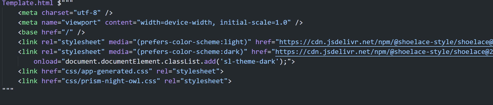
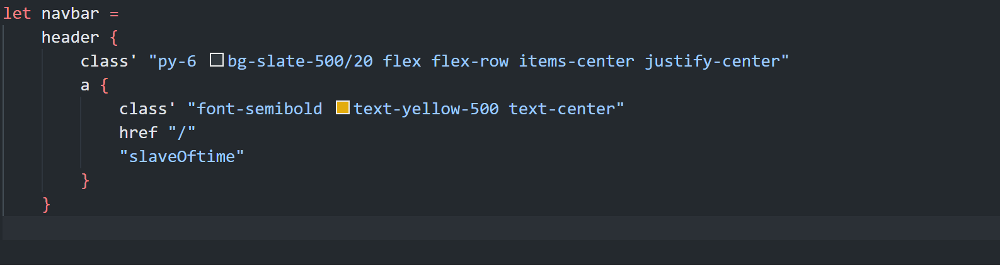
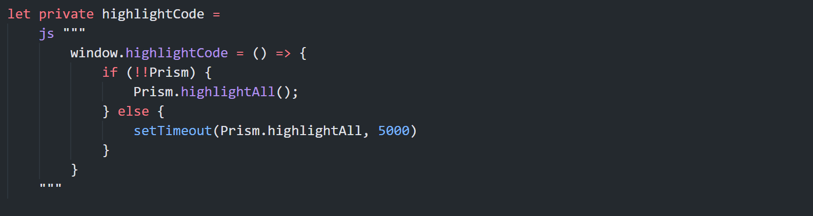

- id: 5cfa9459-5736-4f6c-8358-91de492e0d33
- title: Recreated blog site with Fun.Blazor V2
- keywords: fsharp,blazor
- description: Fun.Blazor V2 is in beta, I want to use it and try more real stuff
- createTime: 2022-02-20
---

> Here is the [source code](https://github.com/slaveOftime/Slaveoftime.Site)

There are two projects:
1. Slaveoftime.Db: is a csharp project with entityframework core which is the easiest thing for me to manage db creation, migration, and CRUD. No need to talk about it in this post. Why csharp? For me it is a right tool for the right thing.
2. Slaveoftime.Site: boot the server, pulling public GitHub repos markdown and save its metadata to data. Serve the UI with prerender for SEO and interaction for users. I will focus on UI part.


## Startup.fs

This is just standard asp.net core minimal API code for register services like and hook up everything.

```fsharp
services.AddDbContext<SlaveoftimeDb>()
services.AddMemoryCache()

services.AddControllersWithViews()
services.AddServerSideBlazor()
services.AddFunBlazorServer()

services.AddTransient<GithubPoolingService>()
services.AddHostedService<PullingBackgroundService>()
services.AddResponseCompression()
services.AddResponseCaching(fun c -> c.MaximumBodySize <- 1024L * 1024L * 5L)
services.AddImageSharp()
```

And setup the pipeline and run it:

```fsharp
app.UseResponseCaching()
app.UseResponseCompression()
app.UseImageSharp()
app.UseStaticFiles()

app.MapBlazorHub()
app.MapFunBlazor(UI.Index.page)

app.Run()
```

## UI/Index.fs

This is used to serve the index page which will be used for prerendering and setup the blazor server SignalR connection.

```fsharp
type Index() =
    inherit FunBlazorComponent()

    override _.Render() = app

    static member page(ctx: HttpContext) =
        let store = ctx.RequestServices.GetService<IShareStore>()
        store.IsPrerendering.Publish true

        // Just get title and keywords for prerendering and SEO
        let metas =
            html.route [
                routeCif "blog/%O" (getPostDetailMeta ctx.RequestServices)
                routeAny getPostListMeta
            ]

        let root = rootComp<Index> ctx RenderMode.ServerPrerendered

        fragment {
            doctype "html"
            html' {
                class' "bg-slate-100 dark:bg-slate-900 scrollbar"
                head {
                    staticHead
                    metas
                }
                body {
                    root
                    staticScript
                    interopScript
                }
            }
        }
```


## UI/Main.fs

In VSCode with extension: "Highlight HTML/SQL templates in F#" we can get highlight and intellisence for below code

In Fun.Blazor V2, this is very efficient way to build static html fragments, because there is only one call hanpening under the hood.
And even in csharp razor engine, the generated code will call exactly the same method.

So, it is good if we can keep static fragments in this way if we are using VSCode. Or even in Visual Studio, after installing extension "Html for F# (Lit Template)", we can still use it. At least it gets code highlight.


```fsharp
let staticHead =
    Template.html $"""
        <meta charset="utf-8" />
        <meta name="viewport" content="width=device-width, initial-scale=1.0" />
        <base href="/" />
        <link rel="stylesheet" media="(prefers-color-scheme:light)" href="https://cdn.jsdelivr.net/npm/@shoelace-style/shoelace@2.0.0-beta.68/dist/themes/light.css">
        <link rel="stylesheet" media="(prefers-color-scheme:dark)" href="https://cdn.jsdelivr.net/npm/@shoelace-style/shoelace@2.0.0-beta.68/dist/themes/dark.css"
            onload="document.documentElement.classList.add('sl-theme-dark');">
        <link href="css/app-generated.css" rel="stylesheet">
        <link href="css/prism-night-owl.css" rel="stylesheet">
    """
```




### Routing

There are only two routes, 
- one is for post detail, which will use fsharp printable string and extract the Guid out
- one is for post list

The html.route will just part the route pattern and call the related function to build a fragment which can be composed with other fragments very easily.

```fsharp
let routes = 
    html.route [
        routeCif "/blog/%O" postDetail
        routeAny postList
    ]
```

In Fun.Blazor V2, all the UI is just a delegate which will be used to render a fragment for attributes or child nodes (element/compoenent).

Computation expression is very cool concept in fsharp, I use it to build all the DSL in Fun.Blazor V2. But there are some tips for using it for better coding experience:

- Keep single CE block smaller, declare more fragments then compose them together
- Keep single file smaller

With those, we can have better readability and inline compiling that will reduce a lot of allocations.

```fsharp
let app =
    div {
        navbar
        routes
        footerSection
    }
```


## UI/PostList.fs

I use tailwindcss + shoelacejs for the styling and controls.

With "Tailwind CSS IntelliSense" + below config in VSCode, we can get intellisense for fsharp code.

```json
"tailwindCSS.experimental.classRegex": [
    "class'[\\s]*\"([^\n]*)\"[\\s]*\n"
]
```




### Inline for performance

Below code is built by the CE DSL:

```fsharp
let private postCard (post: Post) =
    let url = $"blog/{post.Id}?title={post.Title}"
    let title = post.Title
    let viewCount = post.ViewCount
    let author = post.Author
    let description = post.Description
    let createdTime = post.CreatedTime.ToString("yyyy-MM-dd")
    let keywords = keywords post.Keywords

    // To make the whole CE block can be inlined, we need to make sure all its reference is in local scope 
    div {
        class' "p-8 rounded-md bg-gray-600/10 my-5"
        h2 {
            class' "text-purple-500/80 first-letter:text-2xl first-letter:text-yellow-500 underline text-xl font-semibold"
            a {
                href url
                title
                // cannot use post.Title because it will break the fsharp inline and the performance will not be that good
            }
        }
        p {
            class' "text-purple-500/50 text-2xs my-2"
            span { createdTime }
            span {
                class' "pl-3"
                viewCount
            }
            span {
                class' "pl-3 font-semibold"
                author
            }
        }
        keywords
        p {
            class' "text-neutral-400/90 mt-2 text-sm"
            description
        }
    }
```

Let's see what the compiled code will look like (ILSpy translated to csharp):

```csharp
internal int Invoke(IComponent comp, RenderTreeBuilder builder, int index)
	{
		builder.OpenElement(index, ((IElementBuilder)Elts.div).Name);
		int num = index + 1;
		builder.AddAttribute(num, "class", "p-8 rounded-md bg-gray-600/10 my-5");
		int num2 = num + 1;
		builder.OpenElement(num2, ((IElementBuilder)Elts.h2).Name);
		int num3 = num2 + 1;
		builder.AddAttribute(num3, "class", "text-purple-500/80 first-letter:text-2xl first-letter:text-yellow-500 underline text-xl font-semibold");
		int num4 = num3 + 1;
		builder.OpenElement(num4, ((IElementBuilder)Elts.a).Name);
		int num5 = num4 + 1;
		builder.AddAttribute(num5, "href", url);
		int num6 = num5 + 1;
		builder.AddContent(num6, title);
		int num7 = num6 + 1;
		builder.CloseElement();
		int num8 = num7;
		builder.CloseElement();
		int num9 = num8;
		builder.OpenElement(num9, ((IElementBuilder)Elts.p).Name);
		num4 = num9 + 1;
		builder.AddAttribute(num4, "class", "text-purple-500/50 text-2xs my-2");
		num7 = num4 + 1;
		builder.OpenElement(num7, ((IElementBuilder)Elts.span).Name);
		int num10 = num7 + 1;
		builder.AddContent(num10, createdTime);
		num6 = num10 + 1;
		builder.CloseElement();
		num5 = num6;
		builder.OpenElement(num5, ((IElementBuilder)Elts.span).Name);
		int num11 = num5 + 1;
		builder.AddAttribute(num11, "class", "pl-3");
		int num12 = num11 + 1;
		builder.AddContent(num12, viewCount);
		num10 = num12 + 1;
		builder.CloseElement();
		num6 = num10;
		builder.OpenElement(num6, ((IElementBuilder)Elts.span).Name);
		num11 = num6 + 1;
		builder.AddAttribute(num11, "class", "pl-3 font-semibold");
		num12 = num11 + 1;
		builder.AddContent(num12, author);
		num10 = num12 + 1;
		builder.CloseElement();
		num3 = num10;
		builder.CloseElement();
		num8 = num3;
		num3 = keywords(comp, builder, num8);
		builder.OpenElement(num3, ((IElementBuilder)Elts.p).Name);
		num7 = num3 + 1;
		builder.AddAttribute(num7, "class", "text-neutral-400/90 mt-2 text-sm");
		num5 = num7 + 1;
		builder.AddContent(num5, description);
		num4 = num5 + 1;
		builder.CloseElement();
		int result = num4;
		builder.CloseElement();
		return result;
	}
```

So you see everything is inlined together, very less allocation for delegate becuase in fsharp 6 we have InlineIfLambda, so if fsharp can inline our code then the delegate will be removed that will help to reducee a lot of allocation. This the original reason for why I build Fun.Blazor V2, is not just to improve the DSL but also to care about the performance.

I need to quote the tip in the code above again:

> To make the whole CE block can be inlined, we need to make sure all its reference is in local scope 


### Prerender and after render

```fsharp
let postList =
    html.inject (fun (store: IShareStore, globalStore: IGlobalStore, hook: IComponentHook, js: IJSRuntime) ->
        // If it is for prerendering then we will do a sync call so we can get the data and fill the store immedately.
        if store.IsPrerendering.Value then hook.TryLoadPosts(0).Wait()

        // Below callback will happen when the browser rendered the content and SignalR connection is live.
        // Prerender already got the title and keywords information, but after user navigate to other locations those information may be changed so we will need to update again just for better user experience.
        hook.OnFirstAfterRender.Add(fun () ->
            js.changeTitle TitleStr |> ignore
            js.changeKeywords KeywordsStr |> ignore
            hook.TryLoadPosts 0 |> ignore
        )

        // Declare more fragment for better readability
        let cards =
            adaptiview () {
                match! globalStore.UsePosts 0 with
                | DeferredState.Loading -> loader
                | DeferredState.Loaded ps ->
                    for post in ps.Posts do
                        postCard post
                | _ ->
                    html.none
            }


        div {
            class' "sm:w-5/6 md:w-3/4 max-w-[720px] m-auto min-h-[500px]"
            cards
        }
    )
```


## UI/Hooks.fs

In Fun.Blazor every component we build with html.inject will create a new instance of `IComponentHook`, and IServiceProvider will be attached to it. With that we can access all the resources and build a standalone and reusable functions.

I use GlobalStore because it is registered as singleton, so all the user can share the post list. If post list is same and in prerendering then after blazor server setup the SignalR connection it will try to build the server state and sync back to the browser, so if we use the same data at the begining, then the UI will have no flashing. 

```fsharp
type IComponentHook with
    member hook.TryLoadPosts(page) =
        task {
            let sp = hook.ServiceProvider.CreateScope().ServiceProvider
            let logger = sp.GetService<ILoggerFactory>().CreateLogger(nameof hook.TryLoadPosts)
            let store = sp.GetService<IGlobalStore>()

            let postsStore = store.UsePosts(page)

            match postsStore.Value with
            | DeferredState.Loading -> ()
            | DeferredState.Loaded x when x.ExpireDate < DateTime.Now -> ()
            | _ ->
                try
                    let db = sp.GetService<SlaveoftimeDb>()
                    let! posts = db.Posts.OrderByDescending(fun x -> x.CreatedTime).ToArrayAsync() |> Task.map Array.toList
                    postsStore.Publish(DeferredState.Loaded { ExpireDate = DateTime.Now.AddMinutes 5; Posts = posts })
                with
                    | ex -> logger.LogError $"Load posts failed for page {page}: {ex.Message}"
        }
```


## UI/JsInterop.fs

This is for blazor to invoke javascript. We can build a separate js file and add it to the index file too, but here I write in fsharp, because normally those functions are very small and put them in multiple places is hard to manage for me. With the VSCode plugin I mentioned before, we can also get intelicense for it too.

```fsharp
let private highlightCode =
    js """
        window.highlightCode = () => {
            if (!!Prism) {
                Prism.highlightAll();
            } else {
                setTimeout(Prism.highlightAll, 5000)
            }
        }
    """

type IJSRuntime with
    member js.highlightCode() = js.InvokeAsync("highlightCode")
```




I know there is a prism-autoloader.min.js which can automatically highlight the code block in the page for you, but it only works for the first load of your document. When user navigates to different locations, the document will not be fully reloaded, because blazor will just patch the diff of the dom. So I need to manully call it after brower rendered.

For example, below in UI/PostDetail:

```fsharp
hook.OnFirstAfterRender.Add(fun () ->
    hook.IncreaseViewCount postId |> ignore
    hook.TryLoadPost postId |> ignore

    hook.AddDisposes [
        // Use InstantCallback so we can trigger a call immediatly, because the postStore may already cached so it will not load again, and lazy callback will be triggered.
        postStore.AddInstantCallback(
            function
            | DeferredState.Loaded data ->
                js.changeTitle data.Post.Title |> ignore
                js.changeKeywords data.Post.Keywords |> ignore
                // If everything is rendered on the browser, we can invoke js to highlight the code
                js.highlightCode () |> ignore
            | _ -> ()
        )
    ]
)
```

Invoke js is pretty simple concept in blazor server, it just sends a signal by websocket to let the client know which function should be called with arguments.


## Finally

The result is pretty good after the quick coding, it may contain bugs but it works pretty well and the performance is pretty good. At least as a blog reader, I think it is good enough for me. The response time is very slow, the rendering is very consistent.
