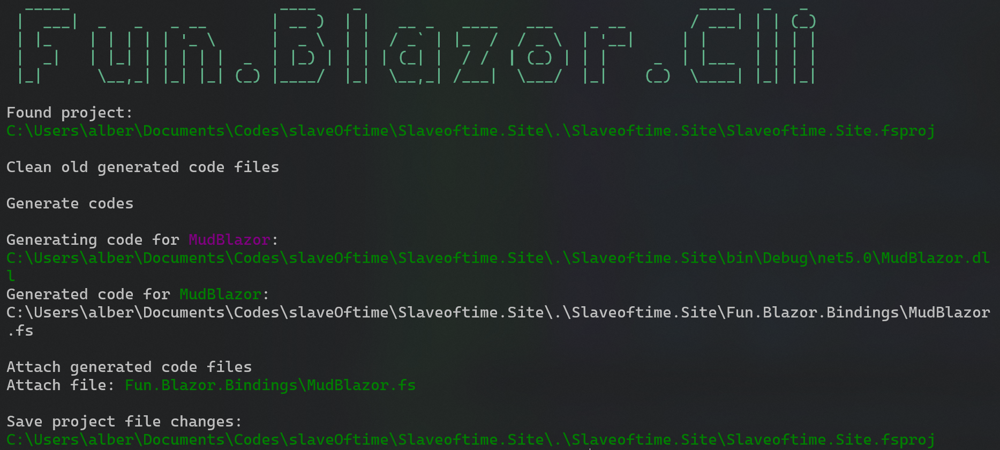

- id: c4907725-73ad-4352-89c2-442a9ff2fb6e
- title: 不用模板写blazor的尝试，折腾无止境
- keywords: blazor,fsharp,dsl
- description: 上回说到我用blazor重写了个人博客，当时用的是fsharp，我暴力生成了MudBlazor的DSL来使用。。。
- createTime: 2021-07-18
---


上回说到我用blazor重写了个人博客，当时用的是fsharp，我暴力生成了MudBlazor的DSL来使用。
> 我一直对MudBlazor的使用有点别扭，因为它的中文谐音实在是让我出戏😂

当时我写了一个简单的.net命令行工具，运行的大概效果如下:


作用就是通过.net的反射把第三方blazor库，比如MudBlazor，AntDesign等，转化成更适合于fsharp书写的形式。

刚开始的时候我生成的风格如下（主要是借鉴fable feliz生态流行的风格）:

```fsharp
mudSwitch<bool>.create [
    mudSwitch.label "Publish current documments"
    mudSwitch.color (if doc.IsPublish then Color.Success else Color.Default)
    mudSwitch.checked' doc.IsPublish
    mudSwitch.checkedChanged (fun x -> ...)
]
```

不过，我一直都觉得这不是太好，因为写起来和看起来都有点啰嗦，虽然我用fable的时候一直也用的feliz及相关的material design库，习惯和忍受了这一点，毕竟没有什么是完美的。

总之无知的冲动让我开始折腾computation expression的风格，踩了几个坑，最后还算有点样子了。我也尝试了一下生成fluent风格，不过没搞出样子来，可能留着以后再接着折腾吧。


最后的效果可以对比一下：

blazor模板风格

```html
<MudSwitch
    Label="Publish current documments"
    Color="Color.Secondary" // 不知道怎么在这写条件语句，直接从MudBlazor拷贝的
    @bind-Checked="@IsPublish"
/>
```

computation expression风格
```fsharp
MudSwitch'() {
    Label "Publish current documments"
    Color (if doc.IsPublish then Color.Success else Color.Default)
    Checked doc.IsPublish
    CheckedChanged (fun x -> ...)
}
```


## 最后


不知道从什么时候开始我有点抵制所有模板编程风格，尽管我最开始转行时接触的是wpf，那时觉得xaml特别好，至少在我当时看来比winform好，后来接触angular，模板的能力变得更强，更灵活，后来又接触了vuejs, sveltejs, blazor。按理说我不应该排斥模板的啊，我应该是熟能生巧，欣然接受的。

可能是因为后来用了react + fable (fsharp)，找到一个小小的舒适区，所以现在面对blazor我的第一反应就是能不能用简单的函数就搞定啊，能不能不学习模板的语法，用我收悉的语言而不是模板语言呢？

这种个人项目带来的感受或者偏见，肯定会让我在公司的项目里面多多少少有些不畅快。毕竟公司现在有个项目是angular，以及正在调研blazor。不过没事，接受变化以不变，哈哈。。。（废话）


源代码请参看：Fun.Blazor