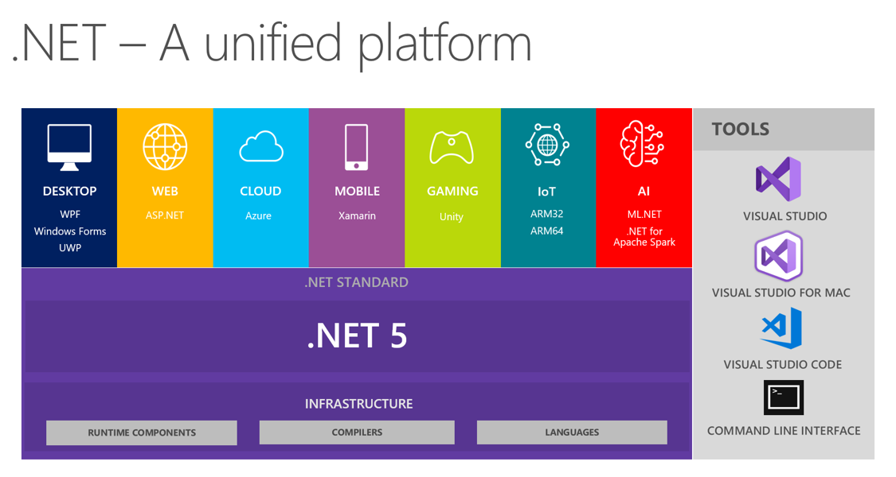

- id: 30a7bb34-a3dd-4391-b48d-8ada2129dcce
- title: 对于全栈开发一点不成熟的抱怨和自我安慰
- keywords: .NET,全栈
- description: 作为全栈开发多年，会写几个后端服务，会写一点前端交互，对其中的快乐与痛苦也略有感悟。
---





这么多年，我都死守.NET技术栈，并非不是不想学习其它技术，只是在内心深处觉得学了那些似乎并非能让我更快、更好地完成任务，反而会增加我学习的成本。也随着自己见识的累积，看着不同的轮子你追我赶，兴衰成败，自己感觉越发地无力，兴许只是自己年纪大了，不像刚入行时那么充满激情了吧。


## 恶（WU）

.net standard 2.0 之后不再支持 .net framework
最开始听说说.net standard的时候，一切都是那么美好，虽然多了这个新概念需要思维上的转变，也需要社区在时间上的消耗，但是nuget上的常用库更新地还是挺快速和简单的，毕竟标准化了很多api，让.net跨平台的生态也不至于太差。

但是，.net standard 2.0之后确不支持.net framework，那问题就来了。我先去给一个客户做的后台用的是asp.net core 2.2，运行在.net frameword上，由于外部一些依赖库是从历史的长河来的，只能跑在.net framework上，就算可以重编译成.net standard，但是我也没有源码来做这个事情，况且这些历史的依赖是由其他人维护更新的，而这些人还都在地球的另一方，他们的目的是兼容.net framework 4.5的啊。

如今我只能眼睁睁看见asp.net core 3.1中那些热腾腾的特性，以及entityframework core 3.1中那些修复和改进在社区里花枝招展，而我永久得把版本号锁定在那。


## xamarin form for wpf

说到底还是我做了错误的选择，或者说 Avalonia.FuncUI 来得太晚。

由于我痴迷与MVU的开发模式，加上 Fabulous 只支持Xamarin，为了写一个后台服务管理的桌面软件，我毅然选择了 Fabulous，然后编译到wpf。可惜xamarin form 对 wpf 的支持真的很差劲，很多可爱又熟悉的属性都没有，扩展起来又很麻烦。虽然结果还不错，但是过程并不算流畅。


## css

一直一来我对css都保持着一种畏惧的心态，当年写wpf的时候，每一个样式的修改可以说是非常精准，指哪打哪，虽然我也没怎么学过，但是照猫画虎用一段时间之后做UI布局和样式控制的代码还都是非常符合预期的。但是到了css里，始终感觉很难控制各个组件的细节。我最常遇见的困难就是“为什么滚动条被截取了一部分？”，“为什么这个控件左边被截取了一部分？我不就是加了一个margin吗。”。当然，也可以怪我学艺不精。但是，很多css的属性真的太难控制了，尤其是需要各种属性的组合才能完成的效果，基本上我以为那样做可以的，最后写出来效果都不是那样。

还有一个我不太喜欢的就是class的顺序问题。比如我定义了一个组件默认用了一些class: btn-normal。但我重用这个组件的时候我会给它一个新的class: btn-primary。但是如果在css文件中btn-primary定义的顺序在btn-normal之前的花，那么btn-primary里的某些属性就不会有效果。

因为，我最近在用 tailwindcss，我通常会这样写：


```fsharp
let myBtn (text, classes) =
    Html.button [
        prop.text text
        prop.classes [
            ...
            Tw.``bg-white``
            yield! classes
        ]
    ]

// 这时候我的 class: ``bg-green-200`` 就不会起作用。
myBtn ("Hi world", [
    Tw.``bg-green-200``
])
```

这对我来说就很不符合自觉，而一旦一件事情不符合自觉，也就意味着我会经常犯错误，而且为了克服这种限制我的代码就会被改得不符合直觉，进而维护起来就难了，而且也不容易阅读。


## 喜


说了一堆wu，还是说点喜欢的比较好，不然这个阴天就实在太闷了。


### 新的.net项目文件

以前的 .csproj 或 .fsproj 里面的内容可以说是没人想看或想改，而且有的对于nuget包的管理还有单独的文件。现在可以说是清爽了太多了，可以说是既功能丰富，又极致简洁了。

```xml
<Project Sdk="Microsoft.NET.Sdk">
  <PropertyGroup>
    <OutputType>Exe</OutputType>
    <TargetFramework>netcoreapp5.0</TargetFramework>
  </PropertyGroup>

  <ItemGroup>
    <Compile Include="Program.fs" />
  </ItemGroup>
</Project>
```

### tailwindcss

虽然先前抱怨的时候提到过它，但是目前还是喜欢它的，毕竟我不用在手写奇葩又不好维护的css文件了，对样式的控制还算是不错的，但是还有待提高。


### feliz

有了它我对html的控制和表达能力也有所提升了，至少可以少查一些文档，以及可以让代码可读性更高。比如写一个 github 跳转条幅：

```fsharp
let view =
    Html.div [
        prop.classes [ Tw.``fixed``; Tw.``top-0``; Tw.``right-0`` ]
        prop.children [
            Html.a [
                prop.text "GITHUB"
                prop.classes [ 
                    Tw.``bg-github-color``; Tw.uppercase; Tw.``text-gray-lighter``
                    Tw.``text-center``; Tw.``py-01``; Tw.``text-xs``; Tw.``shadow-lg``
                    Tw.block; Tw.``hover:bg-brand``
                ]
                prop.style [ 
                    style.transform [
                        transform.rotate 60
                    ]
                    style.width 200
                    style.margin (22, -70, 0, 0)
                ]
                prop.href "https://github.com/albertwoo/tetris"
            ]
        ]
    ]
```

### #r "nuget: FSharp.Data"

以前我都是用paket来管理fsharp脚本的第三方依赖的，虽然功能很强，但是总体来说还是很麻烦的，而且反直觉。如今有了#r "nuget: ..." 那脚本的管理就简单多了。不过这个功能还在预览阶段，不过今年肯定就会有IDE支持了。


## 最后

唉，我发现了，其实我对这些技术的喜好，基本上都不是对技术底层的拷问，也不是对性能的极致追求，而只是在开发和维护效率上的纠结和自嗨。相对于那些技术大牛的喜怒哀乐，我这些可以说是难登大雅之堂啦。

以上！