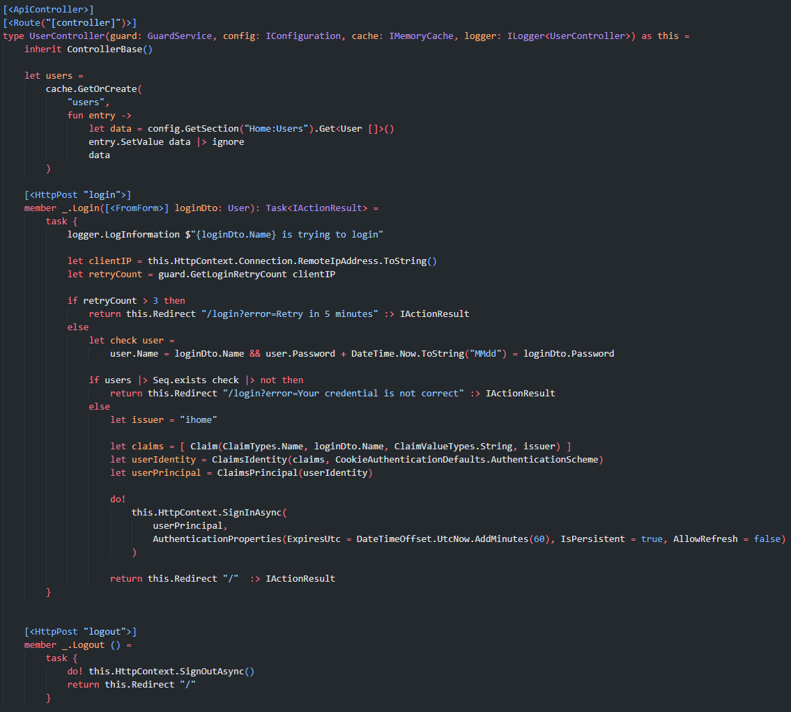
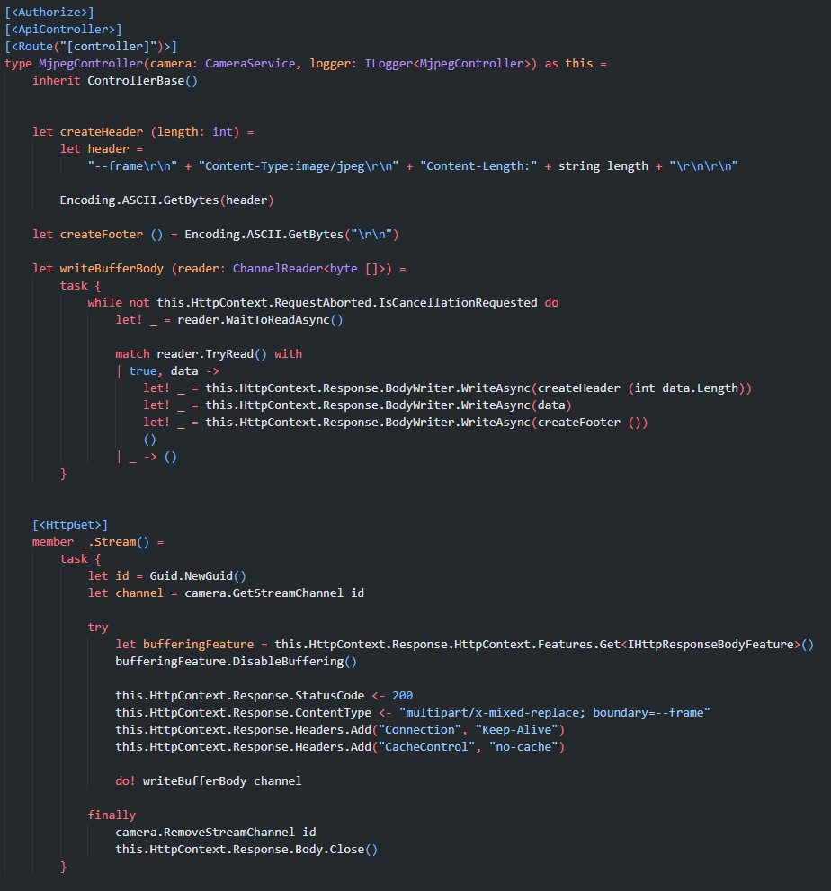
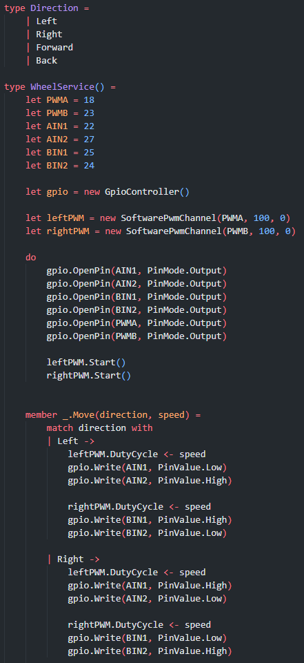

- id: e2c6cec0-0c46-44b5-838b-85d6ed31d3b5
- title: Blazor和树莓派是个好搭配👍
- keywords: blazor,樹莓派
- description: 我摸鱼想做的就是当我离开家的时候，我用手机可以远程连接到我的树莓派，然后通过浏览器登录后，来控制四轮机器人运动，并实时预览摄像头画面
- createTime: 2022-01-09
---

前不久我提了一个问题关于blazor的优缺点：微软 Blazor 对比其他技术栈在实际应用中的缺点是什么？

​
其中说到blazor server side模式消耗服务器连接数和内存等，是一个有状态的连接。但是转念一想，如果你要做一个实时一点的系统，比如实时更新股票，看板，监控等等，一个长链接其实是最好的。另外如果把blazor server side看成是BFF层的话，其实也还可以，随着用户的增加，添加POD就行；而且还有一个好处就是隐藏你几乎所有API，因为都是一个websocket完成事件和UI等的同步的，你在这一层聚合了你的后端微服务的API，然后就像React Server Component一样把UI渲染好再传到浏览器。这样一想应用场景就还挺多的了。WASM模式这里就先不说了。

还是说回树莓派吧，我摸鱼想做的就是当我离开家的时候，我用手机可以远程连接到我的树莓派，然后通过浏览器登录后，来控制四轮机器人运动，并实时预览摄像头画面。

网络上来说，我是这么做的：
    手机浏览器 -->
    百度云VM (公网IP) + FRP 做tcp隧道 -->
    家里的树莓派 （FRP 客户端）+ aspnet core blazor 服务端

## Login

我主要要完成的就是aspnet core blazor这个服务端程序。其中提供UserController来实现登录，用户名密码都配置在配置文件（**娱乐项目，但不严谨之处还望指教**）
​

## 視頻

另外一个重要的就是**MjpegController**，主要用来提供视频流，浏览器端用一个img标签就可以了。此处我还用到System.Threading.Channel（类似go routine），目的是让多个登录用户都可以获得隔离的MJEPG流。因为通过VideoDevice获取的图像需要通过ImageSharp进行处理，这个很影响实时性和性能，所以处理一次然后让不同的channel来共享应该是比较好的吧。
​

## GPIO 控制

当然还要控制车轮，下面只截取了左右控制的代码，但是控制上还是非常简单的，都是处理不同的gpio，PWM来控制速度。当然这些gpio都是我买的那一套树莓派玩具车设计好的。
​

## UI

界面组件方面，我用的是**tailwindcss+shoelace(web component)**，这些和我做的一个小库slaveOftime/Fun.Blazor: Powered by bolero and blazor!!! ❤ F# (github.com) 结合在一起来写blazor还是非常不错的。比如控制轮子的UI，我直接注入前面写的WheelService就可以控制了。非常简单，没有前后端分离带来的繁琐，以及api暴露的恐惧。

## 最后

源码在此处：https://github.com/slaveOftime/IHome

必须得夸一下VSCode，真的是太方便了，直接ssh到树莓派里面，命令行装好.NET SDK以及一些智能提醒的VSCode插件就可以起飞了，这个开发效率和舒爽简直是无法言语。。。
当然还得吐槽一下 dotnet/iot 里面那个 VideoDevice 库，真的是花了我最多的时间，后来不得不把源码拉下来才能在树莓派4B上用起来。而且它默认用的是System.Drawing，搞了两个大循环（YuyvToRgb >> RgbToBitmap）来处理每一帧的图片，太慢了，差不多处理一张图片要一两百毫秒。最后，我把它那些逻辑整合成在一起，然后用ImageSharp的LoadPixelData批量写入像素，最后实时性还可以。当然实时性还得看网速，图片越大，当然就越慢了。视频里面用的是320x240，并且是在一个局域网里，还是不错的。如果用手机在户外连的话，还是160x120比较好。不过以后可以做一个让用户可选清晰度，或自动根据网速调节清晰度的功能。